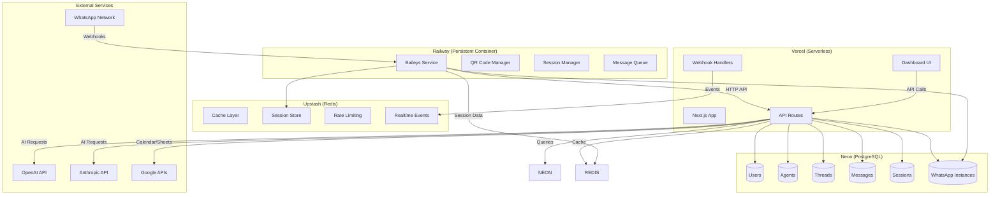

# C4 Container Diagram - ia_agent



## Container Responsibilities

### Next.js Application (Vercel)
- **API Routes**: REST endpoints for all operations
- **Dashboard UI**: React components for admin interface
- **Webhook Handlers**: Process incoming events
- **Server Actions**: Form submissions and mutations

### Baileys Service (Railway)
- **WhatsApp Connection**: Persistent WebSocket connection
- **QR Code Generation**: Authentication flow
- **Message Processing**: Queue and retry logic
- **Session Management**: Connection state persistence

### Neon PostgreSQL
- **Primary Data Store**: All application data
- **ACID Transactions**: Data consistency
- **Branching**: Staging environments
- **Connection Pooling**: Performance optimization

### Upstash Redis
- **Caching**: Frequently accessed data
- **Session Store**: WhatsApp connection state
- **Rate Limiting**: API protection
- **Realtime Events**: WebSocket pub/sub

## Technology Stack per Container

### Next.js Container
```typescript
// Runtime: Node.js 20 (serverless)
// Framework: Next.js 15 with App Router
// Language: TypeScript
// ORM: Drizzle ORM
// Validation: Zod
// UI: Shadcn + Tailwind CSS
```

### Baileys Container
```typescript
// Runtime: Node.js 20 (persistent)
// Framework: Express.js (for API)
// Library: @whiskeysockets/baileys
// Queue: Bull Queue + Redis
// Storage: PostgreSQL (for sessions)
```

## Communication Patterns

### Synchronous Communication
- **HTTP/REST**: Next.js ↔ Baileys Service
- **Database Queries**: Next.js ↔ Neon
- **Cache Operations**: Next.js ↔ Upstash

### Asynchronous Communication
- **Webhooks**: WhatsApp → Baileys Service
- **Message Queue**: Internal processing
- **Pub/Sub**: Realtime updates via Redis
