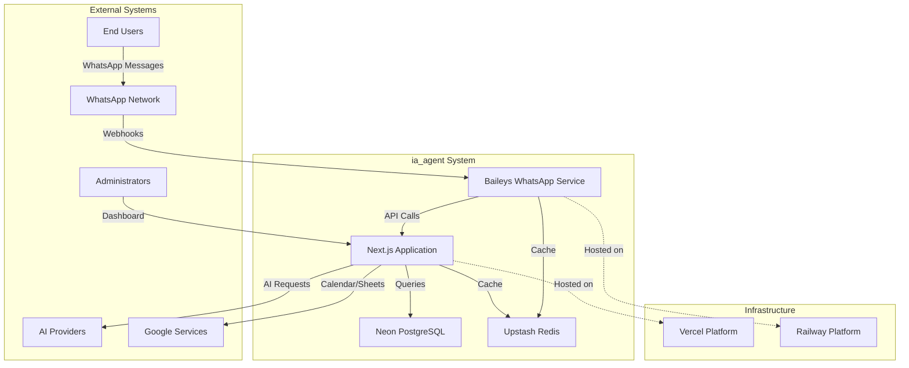

# C4 Context Diagram - ia_agent

## System Interactions

### Primary Flow
1. **User sends WhatsApp message** → WhatsApp Network
2. **WhatsApp webhook** → Baileys Service (Railway)
3. **Baileys processes** → HTTP API to Next.js (Vercel)
4. **Next.js processes** → AI Provider + Database + Redis
5. **Response flows back** through same path

### Admin Flow
1. **Admin accesses dashboard** → Next.js (Vercel)
2. **Configuration changes** → Neon Database
3. **Real-time updates** → WebSocket/Redis

## Key Design Decisions

- **Stateless Frontend**: Next.js on Vercel (serverless)
- **Stateful WhatsApp Service**: Baileys on Railway (persistent container)
- **Serverless Database**: Neon (branching, scaling)
- **Serverless Cache**: Upstash Redis (edge, pay-per-use)
