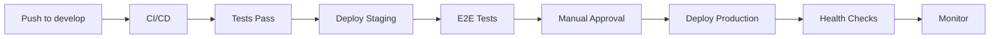

# 🛣️ Roadmap de Implementação

## 📋 Executive Summary

Este documento define o plano completo para evoluir a arquitetura do **ia_agent** de um monolito local para uma arquitetura cloud-native escalável.

**Timeline Estimada:** 4-6 semanas  
**Investimento Inicial:** $15-30/mês  
**Equipe Necessária:** 1-2 desenvolvedores

---

## 🎯 Visão Geral

### Estado Atual
```
┌─────────────────────────────────────┐
│ Docker Compose (Local)              │
│ ├── Next.js + Baileys (monolito)   │
│ ├── PostgreSQL 15                   │
│ └── Redis 7                         │
└─────────────────────────────────────┘
```

### Estado Futuro
```
┌─────────────────┐    ┌──────────────────────┐
│ Vercel (Serverless) │  │ Railway (Persistent)  │
│   Next.js App      │  │   Baileys Service     │
└─────────┬───────────┘  └─────────┬────────────┘
          │                       │
          ▼                       ▼
┌─────────────────┐    ┌──────────────────────┐
│ Neon (PostgreSQL) │  │ Upstash (Redis)      │
└─────────────────┘    └──────────────────────┘
```

---

## 📅 Sprint Planning

### Sprint 1: Foundation (P0 - Crítico)
**Duração:** 1 semana  
**Objetivo:** Migrar infraestrutura core para cloud

#### Tasks:
- [ ] **Setup Neon Database**
  - Criar conta Neon
  - Migrar schema existente
  - Configurar connection pooling
  - Testar performance

- [ ] **Setup Upstash Redis**
  - Criar conta Upstash
  - Migrar configurações de cache
  - Atualizar environment variables
  - Testar latência

- [ ] **Configurar Vercel**
  - Conectar repositório ao Vercel
  - Configurar environment variables
  - Setup preview deployments
  - Deploy inicial

- [ ] **Health Checks**
  - Implementar `/api/health`
  - Configurar monitoring básico
  - Testar conectividade

#### Deliverables:
✅ Database PostgreSQL na nuvem  
✅ Cache Redis na nuvem  
✅ Next.js rodando no Vercel  
✅ Health checks funcionando  

#### Riscos:
- **Downtime** durante migração: Mitigado com backup
- **Performance** diferente local vs cloud: Mitigado com testes

---

### Sprint 2: WhatsApp Service (P0 - Crítico)
**Duração:** 1 semana  
**Objetivo:** Separar serviço WhatsApp em container independente

#### Tasks:
- [ ] **Criar Microserviço WhatsApp**
  - Novo repositório `whatsapp-service`
  - Setup Express + Baileys
  - Implementar API endpoints
  - Dockerfile + Railway config

- [ ] **Migrar Lógica Baileys**
  - Extrair código do Next.js
  - Implementar session persistence
  - Setup message queue
  - Error handling + retry

- [ ] **Integração Next.js ↔ WhatsApp**
  - HTTP API client
  - Webhook handling
  - Error propagation
  - Timeout handling

- [ ] **Deploy Railway**
  - Setup Railway account
  - Configurar environment
  - Deploy inicial
  - Testar conexão

#### Deliverables:
✅ Serviço WhatsApp independente  
✅ API REST para comunicação  
✅ Deploy no Railway  
✅ Integração funcionando  

#### Riscos:
- **Conexão WebSocket** instável: Mitigado com retry logic
- **Session loss** após restart: Mitigado com PostgreSQL persistence

---

### Sprint 3: Monitoring & CI/CD (P1 - Alto)
**Duração:** 1 semana  
**Objetivo:** Setup observabilidade e pipeline automatizado

#### Tasks:
- [ ] **Error Tracking**
  - Configurar Sentry
  - Integrar com Next.js
  - Setup error boundaries
  - Configurar alerts

- [ ] **Uptime Monitoring**
  - Setup Better Stack
  - Configurar health checks
  - Integrar com Slack
  - Testar notificações

- [ ] **CI/CD Pipeline**
  - Implementar workflow melhorado
  - Setup test automation
  - Configurar staging environment
  - Deploy automático

- [ ] **Custom Metrics**
  - Implementar métricas de negócio
  - Dashboard básico
  - Performance tracking
  - Cost monitoring

#### Deliverables:
✅ Error tracking completo  
✅ Uptime monitoring  
✅ CI/CD automatizado  
✅ Métricas customizadas  

#### Riscos:
- **Alert fatigue**: Mitigado com thresholds adequados
- **Pipeline complexity**: Mitigado com documentação

---

### Sprint 4: Production Hardening (P2 - Médio)
**Duração:** 1 semana  
**Objetivo:** Preparar para produção

#### Tasks:
- [ ] **Security**
  - Rate limiting
  - API key management
  - CORS configuration
  - Security headers

- [ ] **Performance**
  - Database optimization
  - Cache strategies
  - Bundle optimization
  - CDN setup

- [ ] **Backup & Recovery**
  - Database backups
  - Session backups
  - Disaster recovery plan
  - Restore procedures

- [ ] **Documentation**
  - Architecture docs
  - Runbooks
  - Troubleshooting guides
  - Onboarding docs

#### Deliverables:
✅ Security hardened  
✅ Performance otimizada  
✅ Backup configurado  
✅ Documentação completa  

#### Riscos:
- **Performance regression**: Mitigado com benchmarking
- **Security gaps**: Mitigado com security audit

---

## 💰 Estimativa de Custos

### Mensal (Produção)
| Serviço | Plano | Custo (USD) |
|---------|-------|-------------|
| **Vercel Pro** | Pro | $20 |
| **Neon** | Scale | $25 |
| **Upstash Redis** | Pro | $5 |
| **Railway** | Hobby | $10 |
| **Sentry** | Team | $80 |
| **Better Stack** | Starter | $12 |
| **Total** | | **$152/mês** |

### Free Tier (Desenvolvimento)
| Serviço | Plano | Custo (USD) |
|---------|-------|-------------|
| **Vercel** | Hobby | $0 |
| **Neon** | Free | $0 |
| **Upstash** | Free | $0 |
| **Railway** | Free | $0 |
| **Sentry** | Free | $0 |
| **Total** | | **$0/mês** |

### Escalabilidade
- **1K usuários**: $152/mês
- **10K usuários**: ~$300/mês (Neon Scale + Railway Pro)
- **100K usuários**: ~$800/mês (Vercel Enterprise + mais recursos)

---

## 🚀 Checklists de Implementação

### Checklist Sprint 1
```markdown
- [ ] Criar conta Neon
- [ ] Migrar database para Neon
- [ ] Testar conexões
- [ ] Criar conta Upstash  
- [ ] Configurar Redis
- [ ] Setup Vercel
- [ ] Deploy preview
- [ ] Implementar health checks
- [ ] Testar performance
- [ ] Documentar processo
```

### Checklist Sprint 2
```markdown
- [ ] Criar repositório whatsapp-service
- [ ] Setup Express + Baileys
- [ ] Implementar API endpoints
- [ ] Dockerfile configurado
- [ ] Migrar lógica Baileys
- [ ] Setup message queue
- [ ] Configurar Railway
- [ ] Deploy serviço
- [ ] Testar integração
- [ ] Monitorar logs
```

### Checklist Sprint 3
```markdown
- [ ] Configurar Sentry
- [ ] Setup Better Stack
- [ ] Implementar CI/CD
- [ ] Configurar staging
- [ ] Setup métricas
- [ ] Testar alerts
- [ ] Documentar pipeline
- [ ] Treinar equipe
```

### Checklist Sprint 4
```markdown
- [ ] Implementar rate limiting
- [ ] Security audit
- [ ] Performance tuning
- [ ] Setup backups
- [ ] Testar recovery
- [ ] Documentar runbooks
- [ ] Review final
- [ ] Go-live decision
```

---

## 📊 Métricas de Sucesso

### Technical KPIs
- **Uptime**: > 99.9%
- **Response Time**: P95 < 500ms
- **Error Rate**: < 0.1%
- **Database Latency**: < 100ms
- **Cache Hit Rate**: > 80%

### Business KPIs
- **Messages Processed**: > 1000/day
- **AI Response Time**: < 3s
- **WhatsApp Uptime**: > 99.5%
- **User Satisfaction**: > 4.5/5
- **Cost per Message**: < $0.01

---

## 🔄 Processo de Deploy

### Deploy Pipeline


### Rollback Strategy
1. **Immediate**: Vercel rollback (1-click)
2. **Database**: Neon branching + revert
3. **WhatsApp**: Railway restart + session restore
4. **Cache**: Flush Redis + warmup

---

## 🎯 Decision Gates

### Gate 1: Foundation Complete
**Critérios:**
- ✅ Neon database migrado e testado
- ✅ Upstash Redis configurado
- ✅ Vercel deploy funcionando
- ✅ Health checks passando

**Go/No-Go:** Se todos critérios passam, prosseguir Sprint 2

### Gate 2: WhatsApp Service Ready
**Critérios:**
- ✅ Serviço WhatsApp independente
- ✅ API endpoints funcionando
- ✅ Integração com Next.js OK
- ✅ Deploy Railway estável

**Go/No-Go:** Se WhatsApp service estável, prosseguir Sprint 3

### Gate 3: Production Ready
**Critérios:**
- ✅ Monitoring configurado
- ✅ CI/CD automatizado
- ✅ Security implementado
- ✅ Documentação completa

**Go/No-Go:** Se tudo OK, go-live

---

## 📞 Suporte e Emergências

### Contact Matrix
| Tipo | Contato | SLA |
|------|---------|-----|
| **System Down** | Dev Team | 15min |
| **Performance** | Dev Team | 1h |
| **Security** | Security Lead | 30min |
| **Database** | DBA | 2h |

### Emergency Procedures
1. **System Down**: Verificar health checks, identificar serviço afetado
2. **Database Issues**: Verificar Neon status, considerar failover
3. **WhatsApp Issues**: Restart Railway service, verificar sessões
4. **High Latency**: Verificar Vercel metrics, escalar se necessário

---

## 📚 Recursos e Referências

### Documentação
- [Neon Docs](https://neon.tech/docs)
- [Upstash Docs](https://docs.upstash.com)
- [Vercel Docs](https://vercel.com/docs)
- [Railway Docs](https://docs.railway.app)

### Ferramentas
- **Database**: Neon Console + pgAdmin
- **Redis**: Upstash Console
- **Monitoring**: Sentry + Better Stack
- **CI/CD**: GitHub Actions
- **Local Dev**: Docker Compose

### Treinamento
- Next.js on Vercel
- PostgreSQL performance
- Redis best practices
- WhatsApp API limitations

---

## 🏁 Conclusão

Este roadmap transforma o ia_agent de um projeto local para uma plataforma cloud-native production-ready. A abordagem incremental minimiza riscos enquanto entrega valor continuamente.

**Próximos Passos:**
1. Aprovar roadmap e budget
2. Setup contas e ferramentas
3. Iniciar Sprint 1
4. Review semanal do progresso

**Success Criteria:**
- Sistema 100% na nuvem
- Performance mantida ou melhorada
- Custos sob controle
- Equipe capacitada

O futuro do ia_agent é serverless, escalável e production-ready! 🚀
