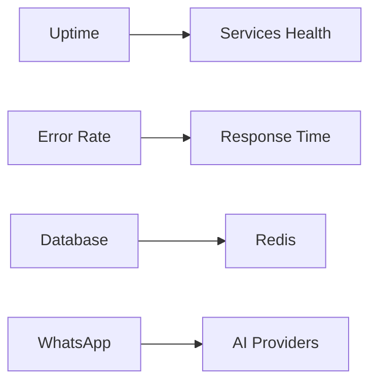
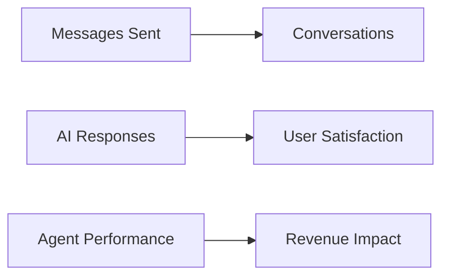
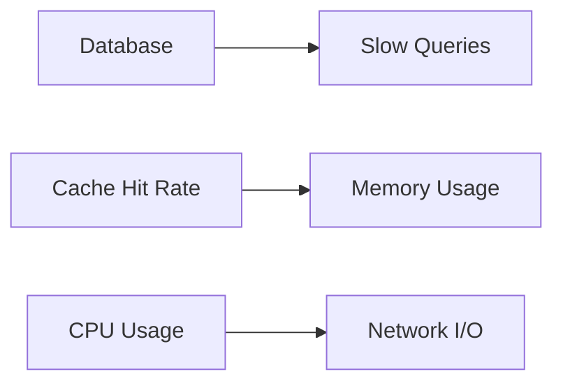

# Stack de Monitoramento e Observabilidade

## 🎯 Estratégia de Monitoramento

**Princípio: Começar simples, evoluir conforme necessidade**

### Fase 1: Essentials (MVP)
- **Vercel Analytics** (já incluído)
- **Vercel Logs** (já disponível)
- **Health Checks** customizados
- **Error Tracking** básico

### Fase 2: Production Ready
- **Sentry** para error tracking
- **Upstash Redis monitoring**
- **Neon Database insights**
- **Custom metrics**

### Fase 3: Advanced
- **APM** completo
- **Dashboard centralizado**
- **Alerting inteligente**
- **Performance profiling**

## 🛠️ Stack Recomendado

### 1. Error Tracking: **Sentry**
```typescript
// Instalação
npm install @sentry/nextjs

// Configuração
// sentry.client.config.ts
import * as Sentry from '@sentry/nextjs';

Sentry.init({
  dsn: process.env.NEXT_PUBLIC_SENTRY_DSN,
  environment: process.env.NODE_ENV,
  tracesSampleRate: 0.1,
  beforeSend(event) {
    // Filtrar dados sensíveis
    if (event.exception) {
      const error = event.exception.values?.[0];
      if (error?.value?.includes('DATABASE_URL')) {
        return null; // Não enviar dados sensíveis
      }
    }
    return event;
  }
});
```

**Por quê Sentry?**
✅ **Integração Vercel**: Nativa e otimizada  
✅ **Free Tier**: 5K errors/mês  
✅ **Source Maps**: Debug automático  
✅ **Performance**: Transaction tracing  

### 2. Uptime Monitoring: **Better Stack**
```typescript
// Health check endpoint
// src/app/api/health/route.ts
import { NextResponse } from 'next/server';
import { db } from '@/lib/db';
import { redis } from '@/lib/redis';

export async function GET() {
  const health = {
    status: 'ok',
    timestamp: new Date().toISOString(),
    checks: {
      database: await checkDatabase(),
      redis: await checkRedis(),
      ai_providers: await checkAIProviders(),
      whatsapp_service: await checkWhatsAppService()
    }
  };

  const isHealthy = Object.values(health.checks).every(check => check.status === 'ok');
  
  return NextResponse.json(health, { 
    status: isHealthy ? 200 : 503 
  });
}

async function checkDatabase() {
  try {
    await db.select().from(users).limit(1);
    return { status: 'ok', latency: Date.now() };
  } catch (error) {
    return { status: 'error', error: error.message };
  }
}
```

**Endpoints para monitorar:**
- `/health` - Health check geral
- `/api/health` - API health específico
- `/health/db` - Database connectivity
- `/health/redis` - Redis connectivity

### 3. Database Monitoring: **Neon Console**
```sql
-- Queries para monitoramento
-- 1. Slow queries
SELECT query, mean_time, calls, total_time
FROM pg_stat_statements
ORDER BY mean_time DESC
LIMIT 10;

-- 2. Connection pool
SELECT state, count(*)
FROM pg_stat_activity
GROUP BY state;

-- 3. Table sizes
SELECT 
  schemaname,
  tablename,
  pg_size_pretty(pg_total_relation_size(schemaname||'.'||tablename)) as size
FROM pg_tables
WHERE schemaname = 'public'
ORDER BY pg_total_relation_size(schemaname||'.'||tablename) DESC;
```

### 4. Redis Monitoring: **Upstash Console**
```typescript
// Redis health check
export async function checkRedisHealth() {
  const start = Date.now();
  
  try {
    await redis.set('health:check', 'ok', { ex: 10 });
    const value = await redis.get('health:check');
    const latency = Date.now() - start;
    
    return {
      status: value === 'ok' ? 'ok' : 'error',
      latency,
      memory: await redis.info('memory'),
      connections: await redis.info('clients')
    };
  } catch (error) {
    return {
      status: 'error',
      error: error.message,
      latency: Date.now() - start
    };
  }
}
```

## 📊 Métricas Essenciais

### Application Metrics
```typescript
// src/lib/metrics.ts
import { createPrometheusMetrics } from '@/lib/prometheus';

export const metrics = {
  // Request metrics
  httpRequestsTotal: new Counter({
    name: 'http_requests_total',
    help: 'Total HTTP requests',
    labelNames: ['method', 'route', 'status']
  }),
  
  httpRequestDuration: new Histogram({
    name: 'http_request_duration_seconds',
    help: 'HTTP request duration',
    labelNames: ['method', 'route'],
    buckets: [0.1, 0.5, 1, 2, 5]
  }),
  
  // Business metrics
  whatsappMessagesTotal: new Counter({
    name: 'whatsapp_messages_total',
    help: 'Total WhatsApp messages',
    labelNames: ['direction', 'status']
  }),
  
  aiRequestsTotal: new Counter({
    name: 'ai_requests_total',
    help: 'Total AI requests',
    labelNames: ['provider', 'model', 'status']
  }),
  
  // Database metrics
  dbConnectionsActive: new Gauge({
    name: 'db_connections_active',
    help: 'Active database connections'
  }),
  
  dbQueryDuration: new Histogram({
    name: 'db_query_duration_seconds',
    help: 'Database query duration',
    labelNames: ['table', 'operation'],
    buckets: [0.01, 0.05, 0.1, 0.5, 1]
  })
};
```

### Middleware de Métricas
```typescript
// src/middleware.ts
import { NextResponse } from 'next/server';
import type { NextRequest } from 'next/server';
import { metrics } from '@/lib/metrics';

export function middleware(request: NextRequest) {
  const start = Date.now();
  
  const response = NextResponse.next();
  
  // Registrar métricas após a resposta
  response.headers.set('x-metrics-start', start.toString());
  
  return response;
}

// Em cada API route:
export async function GET(request: NextRequest) {
  const start = parseInt(request.headers.get('x-metrics-start') || '0');
  
  try {
    // Sua lógica aqui...
    
    // Registrar métricas de sucesso
    metrics.httpRequestsTotal.inc({
      method: 'GET',
      route: '/api/example',
      status: '200'
    });
    
    metrics.httpRequestDuration.observe({
      method: 'GET',
      route: '/api/example'
    }, (Date.now() - start) / 1000);
    
    return NextResponse.json({ success: true });
  } catch (error) {
    // Registrar métricas de erro
    metrics.httpRequestsTotal.inc({
      method: 'GET',
      route: '/api/example',
      status: '500'
    });
    
    throw error;
  }
}
```

## 🚨 Alerting Strategy

### 1. Critical Alerts (Pager)
- **Service Down**: Qualquer serviço unavailable > 5min
- **Error Rate**: > 10% errors em 5min
- **Database**: Connection pool exhausted
- **WhatsApp**: Service disconnected > 2min

### 2. Warning Alerts (Email)
- **High Latency**: P95 > 2s
- **Memory Usage**: > 80%
- **Queue Size**: > 1000 messages
- **AI Rate Limits**: Approaching limits

### 3. Info Alerts (Slack)
- **Deploy Events**: Novo versão deployada
- **High Traffic**: Picos de tráfego inesperados
- **New Users**: Primeiros usos de features

## 📈 Dashboards

### 1. System Overview Dashboard


**Métricas exibidas:**
- Service uptime (99.9% goal)
- Request rate (RPM)
- Error rate (%)
- P95 response time
- Database connections
- Redis memory usage
- WhatsApp connection status
- AI provider latency

### 2. Business Metrics Dashboard


**Métricas de negócio:**
- Messages per day
- Active conversations
- AI response time
- Human takeover rate
- Lead qualification rate
- Meeting booking rate

### 3. Performance Dashboard


**Métricas técnicas:**
- Database query performance
- Cache hit ratios
- Memory/CPU utilization
- Network latency
- Queue processing time

## 🔧 Implementação Prática

### 1. Setup Inicial
```bash
# 1. Sentry
npm install @sentry/nextjs
npx sentry-wizard -s

# 2. Better Stack (Uptime)
# - Criar conta no Better Stack
# - Configurar monitors para endpoints
# - Integrar com Slack/Discord

# 3. Custom Metrics
npm install prom-client @types/prom-client
```

### 2. Environment Variables
```bash
# Sentry
NEXT_PUBLIC_SENTRY_DSN=https://your-dsn@sentry.io/project-id
SENTRY_AUTH_TOKEN=your-auth-token

# Better Stack
BETTERSTACK_API_KEY=your-api-key

# Custom Monitoring
METRICS_ENABLED=true
METRICS_PORT=9090

# Health Checks
HEALTH_CHECK_SECRET=your-secret
```

### 3. Scripts de Monitoramento
```json
{
  "scripts": {
    "health:check": "curl -f http://localhost:3000/api/health",
    "metrics:collect": "node scripts/collect-metrics.js",
    "logs:tail": "vercel logs --follow",
    "db:stats": "node scripts/db-stats.js",
    "redis:stats": "node scripts/redis-stats.js"
  }
}
```

## 💰 Custos Estimados

### Sentry
- **Free**: 5K errors/mês
- **Developer**: $26/mês (100K errors)
- **Team**: $80/mês (400K errors)

### Better Stack
- **Free**: 20 monitors, 6-month data
- **Starter**: $12/mês (50 monitors)
- **Pro**: $49/mês (unlimited monitors)

### Custom Metrics
- **Prometheus**: Free (self-hosted)
- **DataDog**: $15/host/mês
- **New Relic**: $0.25/GB ingest

### Total Estimado
- **MVP**: $0-12/mês (Sentry free + Better Stack free)
- **Production**: $38-75/mês (Sentry Team + Better Stack Pro)
- **Enterprise**: $100+/mês (APM completo)

## 🚀 Roadmap de Implementação

### Sprint 1 (P0)
- [ ] Configurar Sentry no Next.js
- [ ] Implementar health checks básicos
- [ ] Setup Better Stack uptime
- [ ] Logs estruturados com Pino

### Sprint 2 (P1)
- [ ] Métricas customizadas
- [ ] Dashboard básico no Grafana
- [ ] Alertas críticos configurados
- [ ] Database monitoring

### Sprint 3 (P2)
- [ ] APM completo
- [ ] Performance profiling
- [ ] Business metrics
- [ ] Advanced alerting

### Sprint 4 (P3)
- [ ] Log aggregation centralizado
- [ ] Distributed tracing
- [ ] Anomaly detection
- [ ] Cost optimization
