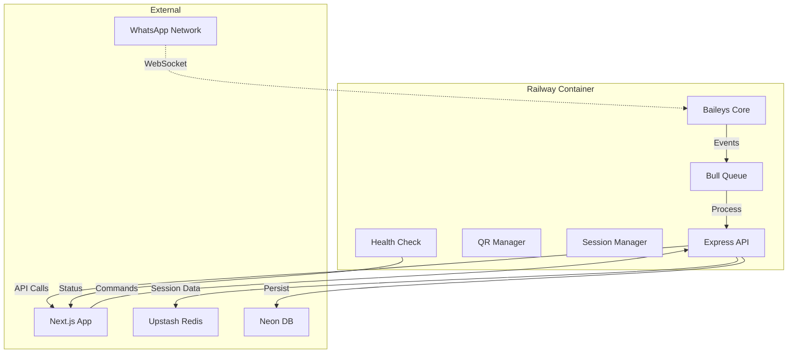

# Arquitetura do Serviço WhatsApp (Baileys) Separado

## 🎯 Decisão: Microserviço Independente

O Baileys **DEVE** ser executado em um container persistente separado do Next.js porque:

1. **Conexão WebSocket Persistente**: WhatsApp exige conexão contínua
2. **Estado de Sessão**: QR codes e tokens precisam persistir
3. **Retry Logic**: Reconexão automática em caso de falha
4. **Scaling Independente**: WhatsApp pode escolar separadamente do app

## 🏗️ Arquitetura Detalhada



## 📁 Estrutura do Microserviço

```
whatsapp-service/
├── src/
│   ├── baileys/
│   │   ├── client.ts          # Baileys client wrapper
│   │   ├── events.ts          # Event handlers
│   │   └── session.ts         # Session persistence
│   ├── api/
│   │   ├── routes/
│   │   │   ├── health.ts      # /health
│   │   │   ├── qr.ts          # /qr/:instanceId
│   │   │   ├── send.ts        # /send
│   │   │   └── status.ts      # /status/:instanceId
│   │   └── middleware/
│   │       ├── auth.ts        # API key validation
│   │       └── rate-limit.ts  # Rate limiting
│   ├── queue/
│   │   ├── processor.ts       # Message processing
│   │   └── jobs.ts            # Job definitions
│   └── app.ts                 # Express app setup
├── Dockerfile
├── package.json
├── railway.json
└── .env.example
```

## 🔧 Implementação Core

### 1. Baileys Client Wrapper
```typescript
// src/baileys/client.ts
import { makeWASocket, DisconnectReason } from '@whiskeysockets/baileys';
import { Boom } from '@hapi/boom';

export class BaileysClient {
    private sock: any;
    private instanceId: string;
    private reconnectAttempts = 0;
    private maxReconnectAttempts = 5;

    constructor(instanceId: string) {
        this.instanceId = instanceId;
    }

    async connect(sessionData?: any) {
        this.sock = makeWASocket({
            auth: sessionData,
            printQRInTerminal: false,
            connectTimeoutMs: 60000,
            qrTimeout: 0,
            defaultQueryTimeoutMs: undefined,
        });

        this.setupEventHandlers();
        return this.sock;
    }

    private setupEventHandlers() {
        this.sock.ev.on('connection.update', async (update: any) => {
            const { connection, lastDisconnect, qr } = update;

            if (qr) {
                await this.saveQRCode(qr);
            }

            if (connection === 'close') {
                const shouldReconnect = (lastDisconnect?.error as Boom)?.output?.statusCode !== DisconnectReason.loggedOut;
                
                if (shouldReconnect && this.reconnectAttempts < this.maxReconnectAttempts) {
                    this.reconnectAttempts++;
                    await this.reconnect();
                }
            }

            if (connection === 'open') {
                this.reconnectAttempts = 0;
                await this.onConnectionOpen();
            }
        });

        this.sock.ev.on('messages.upsert', this.handleMessage.bind(this));
    }

    private async handleMessage(m: any) {
        const message = m.messages[0];
        if (!message.message) return;

        // Add to processing queue
        await queue.add('process-message', {
            instanceId: this.instanceId,
            message: message
        });
    }
}
```

### 2. Express API Server
```typescript
// src/app.ts
import express from 'express';
import cors from 'cors';
import helmet from 'helmet';
import rateLimit from 'express-rate-limit';
import { authMiddleware } from './api/middleware/auth';
import { healthRoutes } from './api/routes/health';
import { qrRoutes } from './api/routes/qr';
import { sendRoutes } from './api/routes/send';
import { statusRoutes } from './api/routes/status';

const app = express();

// Security
app.use(helmet());
app.use(cors({ origin: process.env.ALLOWED_ORIGINS?.split(',') }));

// Rate limiting
const limiter = rateLimit({
    windowMs: 15 * 60 * 1000, // 15 minutes
    max: 100 // limit each IP to 100 requests per windowMs
});
app.use(limiter);

// Auth middleware for all routes except health
app.use('/api', authMiddleware);

// Routes
app.use('/health', healthRoutes);
app.use('/api/qr', qrRoutes);
app.use('/api/send', sendRoutes);
app.use('/api/status', statusRoutes);

export default app;
```

### 3. Queue Processing
```typescript
// src/queue/processor.ts
import { Queue, Worker } from 'bullmq';
import { connection } from '../lib/redis';
import { BaileysManager } from '../baileys/manager';
import { logger } from '../lib/logger';

export const messageQueue = new Queue('message-processing', { connection });

export const messageProcessor = new Worker('message-processing', async (job) => {
    const { instanceId, message } = job.data;
    
    try {
        const baileys = BaileysManager.getInstance(instanceId);
        
        // Forward to Next.js for AI processing
        const response = await fetch(`${process.env.NEXTJS_API_URL}/api/whatsapp/process`, {
            method: 'POST',
            headers: { 'Content-Type': 'application/json' },
            body: JSON.stringify({
                instanceId,
                message: {
                    from: message.key.remoteJid,
                    content: message.message.conversation || message.message.extendedTextMessage?.text,
                    timestamp: message.messageTimestamp
                }
            })
        });

        const result = await response.json();
        
        // Send response back to WhatsApp
        if (result.response) {
            await baileys.sendMessage(message.key.remoteJid, { text: result.response });
        }
        
    } catch (error) {
        logger.error('Failed to process message:', error);
        throw error;
    }
}, { connection });
```

## 🚀 Configuração Railway

### railway.json
```json
{
  "build": {
    "builder": "NIXPACKS"
  },
  "deploy": {
    "startCommand": "npm start",
    "healthcheckPath": "/health",
    "healthcheckTimeout": 100,
    "restartPolicyType": "ON_FAILURE"
  }
}
```

### Dockerfile
```dockerfile
FROM node:20-alpine

WORKDIR /app

COPY package*.json ./
RUN npm ci --only=production

COPY . .

EXPOSE 3000

CMD ["npm", "start"]
```

## 📡 API Endpoints

### Health Check
```http
GET /health
```

### QR Code Generation
```http
GET /api/qr/:instanceId
Response: { qrCode: "base64-qr", status: "connecting" }
```

### Send Message
```http
POST /api/send
{
  "instanceId": "uuid",
  "to": "5511999999999@s.whatsapp.net",
  "message": "Hello World!"
}
```

### Instance Status
```http
GET /api/status/:instanceId
Response: { 
  status: "connected|connecting|disconnected",
  phoneNumber: "5511999999999",
  profileName: "Business Name"
}
```

## 🔐 Segurança

### 1. API Key Authentication
```typescript
// middleware/auth.ts
export const authMiddleware = (req: Request, res: Response, next: NextFunction) => {
    const apiKey = req.headers['x-api-key'] as string;
    
    if (apiKey !== process.env.WHATSAPP_SERVICE_API_KEY) {
        return res.status(401).json({ error: 'Invalid API key' });
    }
    
    next();
};
```

### 2. Rate Limiting
- **100 requests/15min** por IP
- **1000 requests/hour** por API key
- **Burst protection** com Redis

### 3. Environment Variables
```bash
# Service Configuration
PORT=3000
NODE_ENV=production

# Next.js Integration
NEXTJS_API_URL=https://your-app.vercel.app
WHATSAPP_SERVICE_API_KEY=your-secret-key

# Database & Cache
DATABASE_URL=postgresql://...
REDIS_URL=redis://...

# WhatsApp Configuration
MAX_RECONNECT_ATTEMPTS=5
MESSAGE_TIMEOUT=30000
```

## 📊 Monitoramento

### Health Metrics
```typescript
// Health check endpoint
app.get('/health', async (req, res) => {
    const health = {
        status: 'ok',
        timestamp: new Date().toISOString(),
        uptime: process.uptime(),
        version: process.env.npm_package_version,
        connections: baileysManager.getActiveConnections(),
        queueStats: await messageQueue.getJobCounts(),
        memory: process.memoryUsage(),
        redis: await checkRedisConnection(),
        database: await checkDatabaseConnection()
    };

    const isHealthy = health.status === 'ok' && 
                     health.redis && 
                     health.database;

    res.status(isHealthy ? 200 : 503).json(health);
});
```

### Logs Estruturados
```typescript
import pino from 'pino';

export const logger = pino({
    level: process.env.LOG_LEVEL || 'info',
    transport: {
        target: 'pino-pretty',
        options: {
            colorize: true,
            translateTime: 'HH:MM:ss Z',
            ignore: 'pid,hostname'
        }
    }
});
```

## 🔄 Deploy Strategy

### 1. Zero Downtime Deployment
```bash
# Railway supports rolling updates
git push main
# Railway automatically:
# 1. Builds new container
# 2. Runs health checks
# 3. Switches traffic gradually
# 4. Monitors for errors
```

### 2. Environment Management
- **Production**: `railway up`
- **Staging**: `railway up --environment staging`
- **Local**: `docker-compose -f docker-compose.whatsapp.yml up`

### 3. Backup & Recovery
- **Session Backup**: PostgreSQL + Redis persistence
- **Auto-restart**: Railway restart policy
- **Health Monitoring**: Automatic failover

## 💰 Custos Estimados

### Railway (Hospedagem Baileys)
- **Plano Starter**: $5/mês (0.25 CPU, 512MB RAM)
- **Plano Hobby**: $10/mês (0.5 CPU, 1GB RAM)
- **Recomendação**: Starter para começar

### Upstash Redis
- **Free**: 10K commands/dia
- **Pro**: $0.20/10K commands
- **Estimativa**: $2-5/mês para 100K-250K commands

### Total Estimado
- **Início**: $7-12/mês
- **Scale**: $15-30/mês (com mais volume)

## 🚦 Próximos Passos

1. **Sprint 1**: Criar repositório do microserviço
2. **Sprint 2**: Implementar API básica
3. **Sprint 3**: Migrar lógica Baileys do Next.js
4. **Sprint 4**: Deploy em Railway + testes
5. **Sprint 5**: Monitoramento + observabilidade
