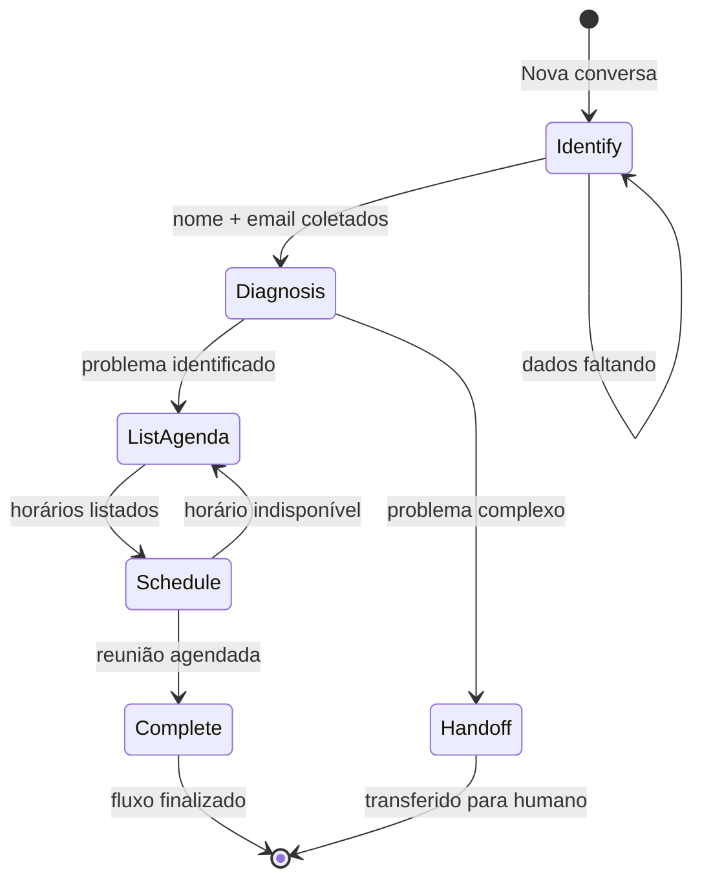

# Agent Builder - Architecture

## 🎯 Overview

O Agent Builder é uma plataforma SaaS para criar agentes de IA baseados em **State Machine (Estágios)**. Diferente de chatbots tradicionais que operam em conversas livres, nossos agentes seguem um **fluxo estruturado** de atendimento.

```
[Identificar] → [Diagnosticar] → [Listar Agenda] → [Agendar] → [Concluir]
```

---

## 🔧 Stack Tecnológica

| Layer | Technology |
|-------|------------|
| **Frontend** | Next.js 15 (App Router), React Query, Zustand |
| **UI** | Shadcn UI, Tailwind CSS, Lucide Icons |
| **Backend** | Next.js API Routes, Server Actions |
| **AI** | Vercel AI SDK Core, OpenAI GPT-4 |
| **Database** | Neon (Serverless Postgres), Drizzle ORM |
| **Auth** | NextAuth.js (Google OAuth) |
| **Integrations** | Google Calendar, Google Sheets, Meta WhatsApp |

---

## 🏗️ Database Architecture

### Core Tables

```
┌─────────────┐       ┌──────────────┐       ┌─────────────┐
│   users     │──1:N──│   agents     │──1:N──│   stages    │
└─────────────┘       └──────────────┘       └─────────────┘
                             │                      │
                             │ 1:N                  │ 1:N
                             ▼                      ▼
                      ┌──────────────┐       ┌─────────────┐
                      │ knowledge_   │       │   actions   │
                      │    base      │       └─────────────┘
                      └──────────────┘
                             
┌─────────────┐       ┌──────────────┐       ┌─────────────┐
│   threads   │──1:1──│   sessions   │──1:N──│  messages   │
└─────────────┘       └──────────────┘       └─────────────┘
```

### Key Relationships

- **User** → owns many **Agents**
- **Agent** → has many **Stages** (workflow) and **Knowledge Base** entries
- **Stage** → has many **Actions** (executadas quando o estágio é ativado)
- **Thread** → has one **Session** (current state) and many **Messages**

---

## ⚙️ Stage Machine Engine

O coração do sistema é a **Stage Machine** que controla o fluxo da conversa.

### Flow Diagram



### Execution Flow

```
1. User sends message
          ↓
2. Load session (current stage, variables)
          ↓
3. Check: required_variables collected?
    ├─ No → Ask for missing data
    └─ Yes → Continue
          ↓
4. Check: entry_condition for NEXT stage met?
    ├─ No → Stay in current stage
    └─ Yes → Advance to next stage
          ↓
5. Execute stage ACTIONS (Calendar, Sheets, etc.)
          ↓
6. Generate AI response with stage context
          ↓
7. Save message + update session
```

### Code Structure

```typescript
// /src/server/engine/stage-machine.ts

export class StageMachine {
    private session: Session;
    private agent: Agent;
    private stages: AgentStage[];
    
    async processMessage(message: string): Promise<AIResponse> {
        // 1. Check if we can advance to next stage
        const transition = await this.evaluateTransition(message);
        
        if (transition.shouldAdvance) {
            // 2. Execute exit actions of current stage
            await this.executeActions(this.currentStage, 'exit');
            
            // 3. Move to next stage
            this.session.currentStageId = transition.nextStageId;
            
            // 4. Execute entry actions of new stage
            await this.executeActions(this.nextStage, 'entry');
        }
        
        // 5. Build prompt with stage context
        const prompt = this.buildPrompt();
        
        // 6. Generate AI response
        const response = await this.generateResponse(prompt, message);
        
        // 7. Extract and save variables from response
        await this.extractVariables(response);
        
        return response;
    }
}
```

---

## 🔌 Integration Architecture

### Google Calendar

```typescript
// /src/server/integrations/google-calendar.ts

interface AvailableSlot {
    start: Date;
    end: Date;
    formatted: string; // "Segunda, 16/12 às 14:00"
}

export class GoogleCalendarService {
    // List available slots based on config
    async listAvailableSlots(config: {
        duration: number;       // 30, 60 minutes
        daysAhead: number;      // 7, 14, 30 days
        timeRange: [string, string]; // ['09:00', '18:00']
        excludeWeekends: boolean;
    }): Promise<AvailableSlot[]>
    
    // Create a new calendar event
    async createEvent(event: {
        title: string;
        start: Date;
        end: Date;
        attendeeEmail: string;
        description?: string;
    }): Promise<{ eventId: string; link: string }>
}
```

### Google Sheets

```typescript
// /src/server/integrations/google-sheets.ts

export class GoogleSheetsService {
    // Append lead data to spreadsheet
    async appendRow(config: {
        spreadsheetId: string;
        sheetName: string;
        data: Record<string, string>; // { Nome: "João", Email: "..." }
    }): Promise<void>
}
```

---

## 🎨 Frontend Architecture

### Builder UI Tabs

```
/dashboard/agents/[id]/builder
├── Tab 1: Personalidade
│   ├── Nome do agente
│   ├── Avatar upload
│   ├── Tom de voz (formal/informal)
│   ├── Usar emojis?
│   └── System prompt principal
│
├── Tab 2: Cérebro (Brain)
│   ├── Upload de arquivos (PDF/TXT)
│   ├── Texto livre (FAQ, info)
│   └── Lista de knowledge entries
│
├── Tab 3: Estágios (Flow)
│   ├── Drag & drop stage list
│   ├── Stage config modal:
│   │   ├── Nome
│   │   ├── Condição de entrada
│   │   ├── Variáveis obrigatórias
│   │   ├── Prompt do estágio
│   │   └── Ação automática
│   └── Visual flow preview
│
├── Tab 4: Integrações
│   ├── Google Calendar (OAuth)
│   ├── Google Sheets (OAuth)
│   └── WhatsApp (Meta API)
│
└── Tab 5: Testar
    └── Chat widget (sidebar)
```

### State Management

```typescript
// /src/stores/builder-store.ts (Zustand)

interface BuilderStore {
    agent: Agent;
    stages: AgentStage[];
    currentTab: 'personality' | 'brain' | 'stages' | 'integrations' | 'test';
    
    // Actions
    updateAgent: (data: Partial<Agent>) => void;
    addStage: (stage: AgentStage) => void;
    updateStage: (id: string, data: Partial<AgentStage>) => void;
    reorderStages: (fromIndex: number, toIndex: number) => void;
    removeStage: (id: string) => void;
    saveChanges: () => Promise<void>;
}
```

---

## 📡 API Endpoints

| Method | Endpoint | Description |
|--------|----------|-------------|
| `GET` | `/api/agents` | List user's agents |
| `POST` | `/api/agents` | Create new agent |
| `GET` | `/api/agents/[id]` | Get agent details |
| `PATCH` | `/api/agents/[id]` | Update agent |
| `DELETE` | `/api/agents/[id]` | Delete agent |
| `GET` | `/api/agents/[id]/stages` | List agent stages |
| `POST` | `/api/agents/[id]/stages` | Create stage |
| `PATCH` | `/api/agents/[id]/stages/[stageId]` | Update stage |
| `DELETE` | `/api/agents/[id]/stages/[stageId]` | Delete stage |
| `POST` | `/api/chat` | Send message (Stage Machine) |
| `POST` | `/api/knowledge` | Add knowledge entry |
| `POST` | `/api/integrations/google/connect` | OAuth callback |
| `POST` | `/api/webhooks/whatsapp` | WhatsApp webhook |

---

## 🔐 Security

- **Authentication**: NextAuth.js with Google OAuth
- **Authorization**: User can only access their own agents/data
- **API Keys**: Stored encrypted in `integrations.credentials`
- **Environment**: All secrets in environment variables

---

## 📈 Scalability Considerations

1. **Sessions table**: Index on `threadId` for fast lookups
2. **Knowledge Base**: Vector embeddings for semantic search
3. **Message history**: Pagination and archival strategy
4. **Rate limiting**: OpenAI API calls per minute
5. **Caching**: React Query for frontend, Redis (future) for backend
